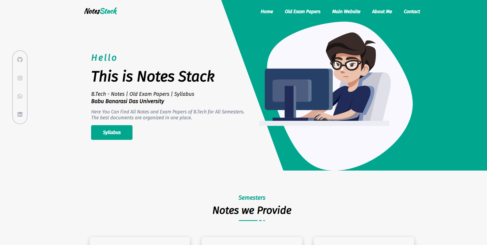

# 📚 NotesStack Project

**NotesStack** is a simple, responsive webpage that helps students easily access BTech semester-wise notes and syllabus.
Built with **HTML**, **CSS**, and a bit of **JavaScript**, the notes are linked via **Google Drive** for easy viewing and downloading.

---

## 🚀 Live Preview

🔗 [View Live Site](https://notesstacks.netlify.app)  
> Deployed on **Netlify*

---

## 📷 Screenshot

---

## 🧠 Features

- ✅ Clean UI for navigating semester-wise notes and syllabus 
- 📂 Organized into subpages (1st, 2nd, 3rd, 4th semesters)  
- 📄 PDF notes hosted on Google Drive  
- 📱 Mobile-friendly layout using responsive design 
- 📨 **Contact section** with:
  - Email (`mailto:`)
  - WhatsApp (`wa.me`)
  - Embedded Google Map
- 🌐 **Social media links** (GitHub, LinkedIn, Instagram) 
- 🔗 Internal page navigation for a seamless experience

---

## 🛠️ Tech Stack

- **HTML5** – for page structure  
- **CSS3** – for styling and responsiveness  
- **JavaScript** – for small interactivity or dynamic effects  
- **Google Drive** – for hosting and linking the PDF notes
- **Google Maps Embed** – for location display

---

## 🙋‍♂️ Author

Made with 💻 by [Madhav Agrawal](https://github.com/MadhavAgrawal06)

---

## 🪪 License

This project is open for learning and personal use.  
Feel free to fork or clone it!
